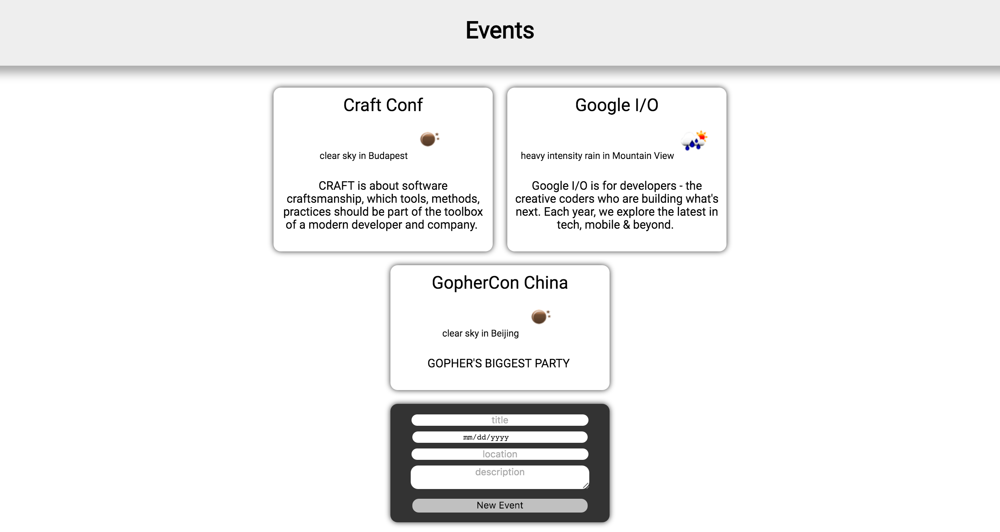

# イベント

このワークショップの目的はGoとGoogle App Engineを使用して、
ゼロからwebアプリケーションを作成してデプロイすることです。

このアプリケーションは各イベントの天気情報を持つイベントマネージャーです。 クール、そうですか？
それは驚くべきことではありませんが、しかしですね ... 私は*本当に*フロントエンドエンジニアではありません。 😅

実装は明らかにステップ0から始まる6つのステップで行われます。

- [ステップ0: 基本アーキテクチャー](step0/README.md)
- [ステップ1: JSONとローカルストレージ](step1/README.md)
- [ステップ2: 永続化ストレージ](step2/README.md)
- [ステップ3: openweathermap.orgで天気を追加する](step3/README.md)
- [ステップ4: Memcacheに一時的な結果を格納する](step4/README.md)
- [ステップ5: アプリケーションの最終版](step5/README.md)

あなたがする必要があるのは、コード内のコメントに対応するので、何も見逃さないでください！
