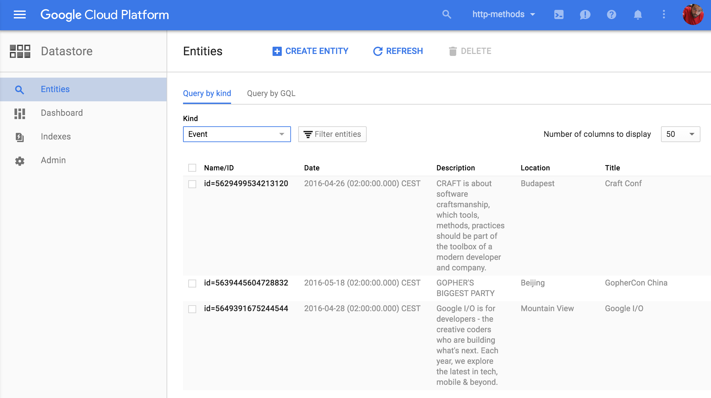

# ステップ2: 永続化ストレージ

このステップでは [Google Cloud Datastore][1] を使用して永続化ストレージを追加します。
ドキュメントを読むことでさらに学習することができます。

私たちが使用するのは [Put][2] 操作と [クエリー][3] です。
あなたのアプリケーションが再び動作するのを確認したら、
Datastoreコンソールで [ローカルのもの][4] または [Google Cloud コンソール][5] のものを見てください。

作業が完了したら、 [データストア](../../section07/README.md#congratulations) の概要に戻ってください。

[1]: https://cloud.google.com/appengine/docs/go/datastore/
[2]: https://cloud.google.com/appengine/docs/go/datastore/reference#Put
[3]: https://cloud.google.com/appengine/docs/go/datastore/queries
[4]: http://localhost:8000/datastore?kind=Event
[5]: https://console.cloud.google.com/datastore
