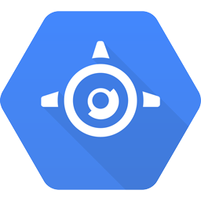

# 4: App Engineへデプロイする

前の章では、簡単なHTTPサーバーを同じプラットフォームの任意のサーバーで簡単に実行できる静的バイナリーとしてGoで書く方法を学びました。

## 成功のために準備する

もしあなたの "Hello, web" がウィルスに感染したらどうなりますか？
あなたのシンプルなバイナリーは負荷を処理しますか？
余剰のサーバーを追加する必要があり、冗長性を持たせるのは良いアイデアです。

あなたはどうですか？ 多くのソリューションがありますが、その中で最も手軽なのはGoogle App Engineです。

<div>
</img>
</img>
</img>
</img>
</img>
</div>

Google App Engineでは、あなたはコードを提供し、Googleは責任を持って取得できる任意のトラフィックの量を処理し、
すべてのサーバーが稼働していることを確認するので、あなたがそれらを心配する必要はありません。 
詳細については [ドキュメント](https://cloud.google.com/appengine/docs) を参照して頂くとして、
これは結局のところワークショップであり、マーケティング文書ではありません。

## Hello, webからHello, App Engineへ

スタンドアローンサーバーからApp Engineアプリに移行するのはかなり簡単なので、
そのプロセスを進めてみましょう。

### Goコードを適用する

いくつかのコードをGoogle App Engineサーバーにデプロイするとき、
あなたはバイナリーではなくGoogleサーバーでコンパイルおよびリンクされるコードを提供します。

これは `main` パッケージと `main` 関数のどちらも定義していないことを意味します。
また、App Engineがあなたのために管理するので、あなたが待ち受けるポートを選択する必要はありません。

これにより以前のコードが単純化されます:

```go
package hello

import (
	"fmt"
	"net/http"
)

func helloHandler(w http.ResponseWriter, r *http.Request) {
	fmt.Fprintln(w, "Hello, App Engine")
}

func init() {
	http.HandleFunc("/hello", helloHandler)
}
```

ご覧のように、ハンドラーを登録する必要があり、App Engineアプリがリクエストを待ち受ける前に実行する必要があるため、
`init` 関数でそれを行います。
Goプログラムのすべての `init` 関数は、すべての変数宣言の後で `main` 関数が始まる前に実行されます。

### http.DefaultClientはもうありません

App Engineでマシンから外に出る任意の操作はコンテキストによって制御されています。
このコンテキストはセキュリティ、クォータ、およびその他の多くの重要な事項を処理します。

これは単に `http.Get` を実行して任意のリモートページを取得すると失敗することを意味しています。
それは悲しいことです。 どのように修正するのでしょうか？ `urlfetch` パッケージをご覧ください！

`urlfetch` パッケージは [google.golang.org/appengine/urlfetch](https://godoc.org/google.golang.org/appengine/urlfetch) で定義されており、
新しいHTTPクライアントを取得するために `appengine.Context` を必要とする `Client` 関数を呼び出します。
それを使用する前に、あなたのマシンにダウンロードする必要があります。 簡単な実行です:

```bash
$ go get -u google.golang.org/appengine/...
```

新しい `appengine.Context` を作成するには `appengine.NewContext` を呼び出してHTTPリクエストを渡す必要があります。

```go
package app

import (
	"fmt"
	"net/http"

	"google.golang.org/appengine"
	"google.golang.org/appengine/urlfetch"
)

func init() {
	http.HandleFunc("/", handler)
}

func handler(w http.ResponseWriter, r *http.Request) {
	// はじめに、新しいコンテキストを生成する
	c := appengine.NewContext(r)
	// そして、そのコンテキストを使用して新しいhttpクライアントを生成する
	client := urlfetch.Client(c)

	// これで、以前のようにhttpクライアントを使用できる
	res, err := client.Get("https://google.com")
	if err != nil {
		http.Error(w, fmt.Sprintf("could not get google: %v", err), http.StatusInternalServerError)
		return
	}
	fmt.Fprintf(w, "Got Google with status %s\n", res.Status)
}
```

App Engineのすべてに基本な `appengine.Context` がどのように使われているかを見ていきます。

### app.yamlを書く

上記のコードに加えて、Google App Engineでは `app.yaml` という名前の記述ファイルが必要です。
このファイルはアプリケーションとそのランタイムを記述し、
`HandleFunc` で行ったのと同様に要求パスに応じて実行されるハンドラーのリストを与えます。

これはHello, App Engineアプリケーションの `app.yaml` ファイルです。

```yaml
runtime: go                    # ランタイム (python, java, go, php)
api_version: go1               # ランタイムのバージョン

handlers:
- url: /.*                     # 全てのリクエストに対して
  script: _go_app              # リクエストをGoコードに渡す
```

## アプリケーションをローカルで実行する

ディレクトリーに `main.go` と `app.yaml` のファイルがあれば、
そのディレクトリーに移動してApp Engine用のGo SDKに付属する `goapp` ツールを実行することで、
アプリケーションをローカルで実行することができます。

	$ goapp serve .

多くのログが表示され、エラーをチェックし、すべて正常に機能する場合は、
次のようなメッセージが表示されます:

	INFO     2016-08-31 15:21:05,793 dispatcher.py:197] Starting module "default" running at: http://localhost:8080

http://localhost:8080/hello にアクセスすれば、美しいWebアプリケーションが再び表示されます。

コードを編集して、出力先に表示されたメッセージを変更してみてください。
ブラウザーを更新すると、サーバーを再起動することなく変更内容が表示されます。

## App Engineサーバーにデプロイする

アプリケーションの出来栄えに納得して、世界中で共有したくなったなら、
それを行うにはGoogle Cloud Platformプロジェクトを作成する必要があります。

1. https://console.developers.google.com にアクセスし、資格情報でログインします。
1. `プロジェクトを作成` をクリックし、名前とプロジェクトIDを選択します

これだけです！ これでコードをGoogle App Engineサーバーにデプロイできます。

`app.yaml` を修正し、作成したプロジェクトのプロジェクトIDを含む `application` 行を変更して、
デプロイするアプリを実行してください:

	$ goapp deploy --version=1 --application=your-project-id .

初めて `goapp` を実行すると、ブラウザーが開いて認証と承認のプロセスを経ますが、
これは一度だけ起こります。

何らかの理由で、これを再度行う必要がある場合は、認証情報を削除することができます:

	$ rm -f ~/.appcfg_oauth2_tokens

これが成功すると、あなたのアプリは https://your-project-id.appspot.com で利用可能になります。

### App Engineにデプロイする演習

上記の手順に従って、これまで作業していたコードをApp Engineにデプロイしてください。

# おめでとうございます！

最初のwebアプリをGoogle App Engineにデプロイしました！
おそらく、世界へそれについて伝える時でしょうか？ あなたのURLにlocalhostはもうありません！

あるいは、少し早すぎるかもしれません ... Goコードに加えてHTMLを使用してアプリケーションを少し良く見せられるかどうか見てみましょう。

[次のセクション](../section05/README.md) に進みます。
