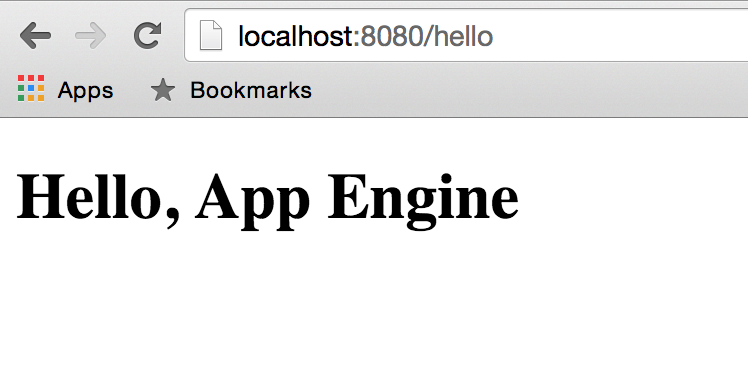

# 5: Hello, HTML

この章では、App EngineでHTMLページを提供する方法と、HTMLとJavaScriptのコンポーネントをGoコードとやりとりさせる方法について学習します。

## 静的コンテンツのみ

とりあえず簡単なHTMLページで始めましょう:

[embedmd]:# (all_static/hello.html /.*DOCTYPE/ $)
```html
<!DOCTYPE html>

<html>
<head>
  <title>Hello, App Engine</title>
</head>
<body>
  <h1>Hello, App Engine</h1>
</body>
</html>
```

この静的ページを提供するための新しい `app.yaml` を作成することができます:

[embedmd]:# (all_static/app.yaml)
```yaml
runtime: go
api_version: go1

handlers:
- url: /hello
  static_files: hello.html
  upload: hello.html
```

ご覧のように、`hello.html` ファイルの内容を表示するパス `/hello` でリクエストを処理しています。

アプリケーションをローカルで実行してみてください（ [ここ](./all_static) ですべてのファイルを見つけることができます）。
これが失敗するのは、Goランタイムは配下に任意のGoコードが含まれていることが必須だからです！

これには2つの解決策があります:

- Pythonコードを必要としないPythonランタイムを使用する

- または任意のGoコードを追加する、これは `dummy.go` ファイルと同じくらい簡単です:

[embedmd]:# (all_static/dummy.go /package dummy/ $)
```go
package dummy
```

後ほどGoコードを追加するので、後者を行います。

アプリケーションをもう一度実行してみてください:

```bash
$ dev_appserver.py .
```

または、それをデプロイします:

```bash
$ gcloud app deploy app.yaml
```

そして出力が期待通りのものであることを確認します:



## 動的コンテンツを提供する: HTML + Go

静的コンテンツでは不十分であることが多く、バックエンドとやりとりするためにWebアプリのフロントエンド（HTML + JS）が必要です。

これを行うには、2つの異なるオプションがあります:

- `app.yaml` を使用してどのリクエストがどの部分で処理されているかを調べる、または、
- 異なるランタイムで複数のサービス（旧名：モジュール）を使用する。

Goサービス（旧名：モジュール）の詳細についてはこの [ドキュメント](https://cloud.google.com/appengine/docs/go/an-overview-of-app-engine) で学習できます。

このワークショップでは、簡単なオプションを使用して、前の `app.yaml` を強化して要件に合わせます。

私たちは3つのコンポーネントを必要とします:

- 前のプログラムと同様のGoプログラム、
- 純粋な静的コンテンツを持つHTMLページ、そして、
- 全てを接着するための `app.yaml` ファイル。

ここで部分的に変更するのは `app.yaml` だけです:

[embedmd]:# (mixed_content/app.yaml)
```yaml
runtime: go
api_version: go1

handlers:
# 空のパスを持つリクエストはhtmlページで表示されます。
- url: /
  static_files: hello.html
  upload: hello.html
# /api/パスのリクエストはGoアプリとして処理されます。
- url: /api/hello
  script: _go_app
```

二つ目のハンドラーの `/api/hello` urlを `/api/backend` に変更してみてください。
なぜ失敗するのでしょうか？ 修正してください。

### フロントエンドからバックエンドにアクセスする

これはあなたが考えることができるJavaScriptフレームワークと同じくらい*多くの*方法で行うことができます。
この簡単な例では、単に [jQuery](https://jquery.com) を使用します。

[embedmd]:# (mixed_content/hello.html /.*DOCTYPE/ $)
```html
<!DOCTYPE html>

<html>
<head>
	<title>Hello, App Engine</title>
	<script src="https://ajax.googleapis.com/ajax/libs/jquery/2.1.4/jquery.min.js"></script>
</head>
<body>
	<h1>Hello, App Engine</h1>
	<p>The backend says: <span id="message"></span></p>
	<script>
		$(function() {
			$("#message").load("/api/hello");
		});
	</script>
</body>
</html>
```

## 大きなアプリケーションのディレクトリー構成

すぐに想像できるように、多くの静的ファイル、任意のHTML、JavaScript、CSSなどを提供したいと思うでしょう。
あなたの `app.yaml` にそれらを列挙するのではなく、
ひとつのディレクトリーにすべてのものを配置するだけのもっと簡単なオプションがあります。

	my_app
	|- app.yaml
	|- hello.go
	\- static
	   |- index.html
	   |- style.css
	   \- script.js

この場合の `app.yaml` は次のようになります:

[embedmd]:# (static_dirs/app.yaml /runtime/ $)
```yaml
runtime: go
api_version: go1

handlers:
# /api/ で始まるリクエストはGoアプリとして処理されます。
- url: /api/.*
  script: _go_app

# パスが空の場合はindex.htmlを表示します。
- url: /
  static_files: static/index.html
  upload: static/index.html

# それ以外の場合は、静的ディレクトリーでパスを探索します。
- url: /
  static_dir: static
```

この種の構造はアプリケーションの明確な構造を提供します。

## 演習: アプリ全体を構築しましょう！

大丈夫、アプリケーションを構築するのに十分な材料があることはわかっています。 それでは、やってみましょう！ 🎉

この [概要](../events) を見てアプリケーションを記述し、[ステップ0](../events/step0/README.md) *のみ*を実装してください。
その後、もう一度戻ってきてください。

# おめでとうございます！

webフロントエンドがGoバックエンドとやりとりする最初のアプリケーションを作成しました！

しかし、バックエンドはプレーンテキストではなくJSONを生成すべきではないですか？
[次の章](../section06/README.md) でJSONのエンコードとデコードについて学習しましょう。
