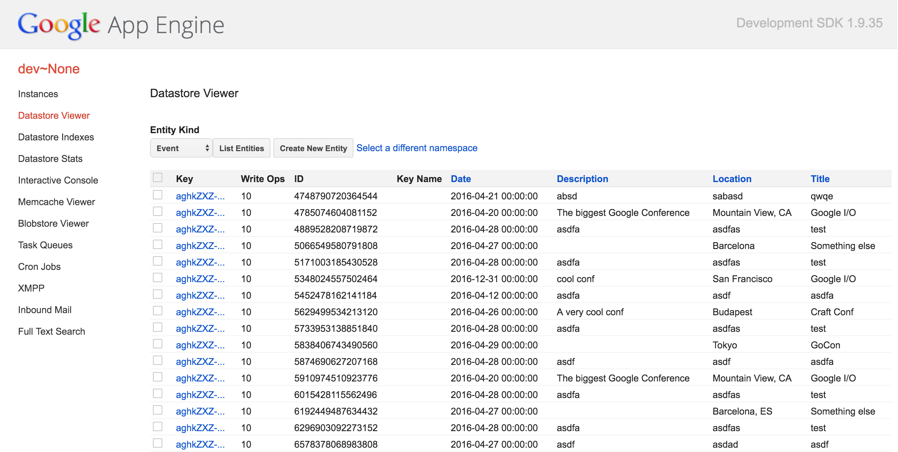

# 7: Cloud Datastoreで永続化ストレージ

この章では、Google Cloud Datastoreの基礎と、
それがどれだけApp Engineアプリに最適なものであるかを学習します。

## Cloud Datastoreの概要

Cloud DatastoreはGoogleによって完全に管理された非リレーショナルデータベースであり、
スケーリング、サイズ変更、パッチ適用、またはいくつかの他の種類のメンテナンスについて心配する必要はありません。

<div style="text-align:center">
  
</div>

[ここ](https://cloud.google.com/datastore/docs/concepts/overview) でCloud Datastoreの詳細を見つけられますが、
このチュートリアルではApp Engineアプリから構造化データを保存する最も簡単な方法としてのCloud Datastoreを検討します。

## App EngineのGoからCloud Datastoreを使用する

App EngineのGoランタイムは、webアプリケーションから使用したいと思う多くのサービスへアクセスさせる一連のパッケージを提供します。
そのうちの1つはCloud Datastoreであり、APIはとてもよく [ドキュメント化](https://cloud.google.com/appengine/docs/go/datastore/) されています。

Datastoreの使用を開始する前に理解しておくべき3つの概念があります:

1. エンティティ、
1. カインド、そして、
1. キー。

エンティティはデータストアに格納された値です。
これはリレーショナルデータベースに格納された行に多少似ていますが、
フィールドのリストとそれに対応する値を持っています。
しかしリレーショナルデータストアとは異なり、これらの行を記述するスキーマはなく、
各エンティティは異なるフィールドセットを持つことができます。

エンティティは与えられた _カインド_ であり、リレーショナルデータベースの行と同じ方法で与えられたテーブルに属します。 
前に使用した型 `Person` を仮定すると、データストアに _カインド_ `Person` があると想像することができます。

データストア内のすべての値はキーに割り当てられて格納されます。 
キーはデータストア内の値を識別して参照する手段です。 キーには2種類あります:

- 完全キー: 現にデータストア内の値を指します
- 不完全キー: 値がまだデータストア内にない場合に使用されます

短い時間で不完全キーの詳細を見てみます。

# データストアにデータを格納する

[`google.golang.org/appengine/datastore`](https://godoc.org/google.golang.org/appengine/datastore) パッケージは `Put` 関数を提供します:

```go
func Put(c appengine.Context, key *Key, src interface{}) (*Key, error)
```

- 最初の引数は `appengine.Context` で、与えられたリクエストに関連するすべての操作をリンクする手段です。

- 二つ目の引数は `*datastore.Key` で、以下のコードスニペットで作成する方法で見ることができます。

- そして、最後の引数は保存される値です。

- この関数は別の `*datastore.Key` を返し、データの格納中に何らかのエラーが発生した場合は、nil以外のエラーを返します。

`datastore.Put` 関数の使い方の例を見てみましょう:

[embedmd]:# (examples/app.go /func complete/ /^}/)
```go
func completeHandler(w http.ResponseWriter, r *http.Request) {
	// HTTPリクエストから新しいApp Engineコンテキストを作成する。
	ctx := appengine.NewContext(r)

	p := &Person{Name: "gopher", AgeYears: 5}

	// Personカインドとgopher値の新しい完全キーを作成する。
	key := datastore.NewKey(ctx, "Person", "gopher", 0, nil)
	// データストアにpを設定する。
	key, err := datastore.Put(ctx, key, p)
	if err != nil {
		http.Error(w, err.Error(), http.StatusInternalServerError)
		return
	}
	fmt.Fprintf(w, "gopher stored with key %v", key)
}
```

このコードをローカルで実行し、ハンドラーが実行されるたびにキーの値が毎回同じであることを確認します: `/Person,gopher` 。

ご覧のように、`datastore.NewKey` を呼び出して `datastore.Key` を作成しています:

```go
func NewKey(c appengine.Context, kind, stringID string, intID int64, parent *Key) *Key
```

完全キーを作成するときは、`string` 値（この例のように）または `int64` を使用するかどうか選択する必要があります。
`stringID` と `intID` のフィールドのうち一つだけが空でなければなりません（`""` or `0`）。

最後の引数は作成しているキーの親を指し示す ```*datastore.Key``` です。 
とりあえず常にnilを使用します。

## 不完全キーを使用する

私たちが使用したいと思う正確なキーを知らないとどうなりますか？
例えば `Person` の異なる値は同じ名前と権利を持つことができ、
それらのキーは同じであるためお互いを上書きします。

解決策は自動生成されたキーを使用することで、これはまさに不完全キーのためのものです。
 `datastore.NewIncompletekey` でそれらを作成します:

```go
func NewIncompleteKey(c appengine.Context, kind string, parent *Key) *Key
```

この関数には `stringID` や `intID` はなく、
キーの最終的な値としてデータストアに値を入れると決定されます。
最終的な値は `datastore.Put` によって返されたキーを使って取得することができます。

[embedmd]:# (examples/app.go /func incompleteHandler/ /^}/)
```go
func incompleteHandler(w http.ResponseWriter, r *http.Request) {
	// HTTPリクエストから新しいApp Engineコンテキストを生成する。
	ctx := appengine.NewContext(r)

	p := &Person{Name: "gopher", AgeYears: 5}

	// Personカインドの新しい不完全キーを生成する。
	key := datastore.NewIncompleteKey(ctx, "Person", nil)
	// データストアにpを設定する。
	key, err := datastore.Put(ctx, key, p)
	if err != nil {
		http.Error(w, err.Error(), http.StatusInternalServerError)
		return
	}
	fmt.Fprintf(w, "gopher stored with key %v", key)
}
```

アプリケーションでこのハンドラーを使用すると、生成されたキーは毎回異なるキーであり、
特定の順序に従わないことがわかります。

# Datastore管理者ページ

アプリケーションをローカルで実行している場合は、
http://localhost:8000/datastore にアクセスしてローカルデータストアの内容を調べることができます。

</img>

実稼働環境にデプロイされたApp EngineアプリのCloud Datastoreの内容を調査する場合は、
[このページ](https://console.developers.google.com/project/_/datastore/stats) をご覧ください。

# Google Cloud Datastoreからデータを取得する

Google Cloud Datastoreからデータを取得するには、主に2つの方法があります:

- キーを指定して値を取得する、または、
- フィルターを使用してデータストアにクエリーを実行する。

## キーで取得する

キーがある場合、Datastoreから値を取得することは `datastore.Get` 関数を呼び出すことと同じくらい簡単です:

```go
func Get(c appengine.Context, key *Key, dst interface{}) error
```

最後の引数は取得するフィールドを含む構造体へのポインターでなければなりません。
たとえば、次のようにします:

[embedmd]:# (examples/app.go /func getHandler/ /^}/)
```go
func getHandler(w http.ResponseWriter, r *http.Request) {
	ctx := appengine.NewContext(r)

	key := datastore.NewKey(ctx, "Person", "gopher", 0, nil)

	var p Person
	err := datastore.Get(ctx, key, &p)
	if err != nil {
		http.Error(w, "Person not found", http.StatusNotFound)
		return
	}
	fmt.Fprintln(w, p)
}
```

この関数には一度に複数の値を取得できるバージョンもあり、バッチ処理が可能な場合にパフォーマンスが向上します。

この関数は `datastore.GetMulti` です:

```go
func GetMulti(c appengine.Context, key []*Key, dst interface{}) error
```

## キーなしで取得する

非常に多くの場合、_カインド_ のすべての値や、特定のフィールドが特定の値と等しいすべての値など、
条件に一致するデータストア内のすべての値を検索したい時があります。
これはSQLの `SELECT` 文に似ています。

それらはDatastoreでこれを行う手段として `datastore.Query` 型を使用しています。
`datastore.Query` の値は `datastore.NewQuery` で作成できます:

```go
func NewQuery(kind string) *Query
```

ご覧のとおり、すべてのクエリーは特定の _カインド_ に関連付けられています。 
クエリーを取得したら、ビルダーパターンとこれらのメソッドのいくつかを使用してフィルターを追加できます:

```go
func (q *Query) Ancestor(ancestor *Key) *Query
```
```go
func (q *Query) Filter(filterStr string, value interface{}) *Query
```
```go
func (q *Query) KeysOnly() *Query
```
```go
func (q *Query) Limit(limit int) *Query
```
```go
func (q *Query) Order(fieldName string) *Query
```

そして最後に、クエリーを実行してクエリーに一致する値を取得できます:

```go
func (q *Query) Count(c appengine.Context) (int, error)
```
```go
func (q *Query) GetAll(c appengine.Context, dst interface{}) ([]*Key, error)
```
```go
func (q *Query) Run(c appengine.Context) *Iterator
```

- Countは、クエリーに一致した値の数を返します
- GetAllは、クエリーに一致したすべての値を `dst` で取得します
- Runは、クエリーに一致するすべての結果を反復処理するために使用できる ```*datastore.Iterator``` を返します。

名前で並べ替えた10歳以下の _カインド_ `Person` のすべての値を取得する例を見てみましょう。

[embedmd]:# (examples/app.go /queryHandler/ /^}/)
```go
func queryHandler(w http.ResponseWriter, r *http.Request) {
	ctx := appengine.NewContext(r)

	var p []Person

	// Personカインドで新しいクエリーを生成する。
	q := datastore.NewQuery("Person")

	// Ageフィールドが10以下の値だけを取得する。
	q = q.Filter("Age <=", 10)

	// 名前フィールドで全ての値を並べ替える。
	q = q.Order("Name")

	// 最後に全ての値をpで取得するクエリーを実行する。
	_, err := q.GetAll(ctx, &p)
	if err != nil {
		// handle the error
		http.Error(w, err.Error(), http.StatusInternalServerError)
		return
	}
	fmt.Fprintln(w, p)
}
```

`Filter` と `Order` は `*datastore.Query` を返します。
つまり、これらの操作をひとつの式に連結することができます。

[embedmd]:# (examples/app.go /q :=.*\.$/ /^$/)
```go
q := datastore.NewQuery("Person").
		Filter("Age <=", 10).
		Order("Name")
```

[ここ](https://cloud.google.com/appengine/docs/go/datastore/queries) でDatastore Queryの詳細を見つけられます。

# 演習: イベントアプリに永続化ストレージを追加する

Datastoreについて（今日のうちに）知っておくべきことをすべて知ったので、
それを使用してイベントアプリケーションに保存されたデータを永続化してみましょう。

[ステップ2](../events/step2/README.md) で作業し、完了したらここに戻ってきてください。

# おめでとうございます！

あなたはGoogle Cloud Datastoreからデータを保存したり取得したりできるようになりました。 
これであなたが想像できるほとんどのアプリケーションを構築する準備が整いました！

それとも、もっと欲しいですか？
その場合は [次の章](../section08/README.md) に進んで `urlfetch` を使用してリモートリソースにアクセスする方法を学習してください。
