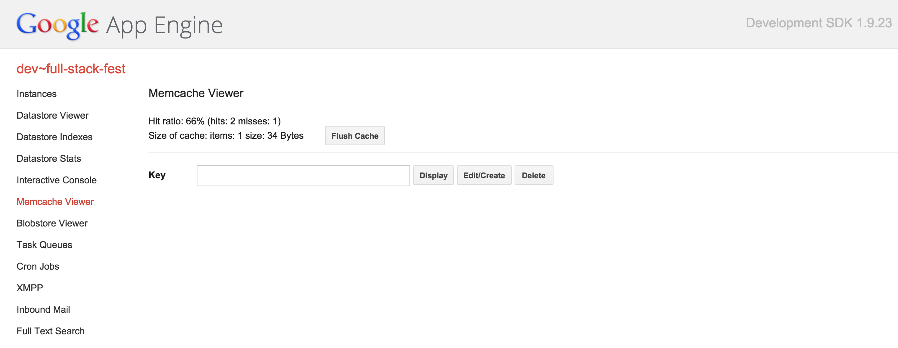
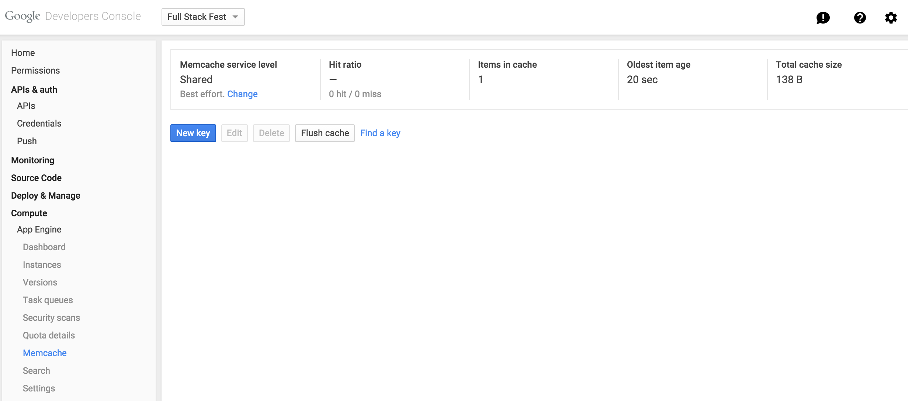

# 9: Memcacheとは何かとApp Engineから使用する方法

MemcacheはGoチームの現在のメンバーである [Brad Fitzpatrick](https://twitter.com/bradfitz) 氏によって最初に開発された、
最もよく知られているキャッシュシステムのひとつです！

App EngineはDatastoreを使用する方法と同様に、
Memcacheを使用する非常に簡単な方法を提供します。
あなたは、あなたがビジネス以外のものを気にする必要がないように、
Googleがメンテナンス、拡張、更新する完全に管理されたMemcacheインスタンスにアクセスできます。

Memcacheは指定された時間内にデータを保持し、指定した時間が経過すると値を削除します。 
耐久性の保証がないため、Memcacheで回復できないものは保存しないでください。 
言い換えれば、Memcacheが動作していなかった場合でも、
おそらく少し遅いながらアプリケーションは完全に動作するはずです。

## GoのApp Engineランタイムから使用する

先ほど紹介したパッケージは、Goランタイムにて [`google.golang.org/appengine/memcache`](https://godoc.org/google.golang.org/appengine/memcache) という名前でパッケージが提供されています。

memcacheで行える操作は主に2つあります:

- `memcache.Set` でデータをキャッシュする、そして
- `memcache.Get` でデータを取り戻す。

### データをキャッシュする

`memcache.Set` 関数を使用します:

```go
func Set(c appengine.Context, item *Item) error
```

最初の引数はいつものように `appengine.Context` であり、二つ目は保存したいitemです。
ここでは `memcache.Item` 型の3つのフィールドに注目しましょう:

```go
type Item struct {
	Key        string
	Value      []byte
	Expiration time.Duration

	// わかりやすくするためにいくつかのフィールドを削除しました
}
```

- Keyは、単純な文字列で、値を識別できます。
- Valueは、最大1Mbサイズのスライスです。
- Expirationフィールドは、値が有効である期間を示します。

キー "name" と値 "gopher" を持つitemを1時間有効にして保存する場合、
次のように書くことができます:

[embedmd]:# (getset/app.go /package app/ /^}/)
```go
package app

import (
	"fmt"
	"net/http"
	"time"

	"google.golang.org/appengine"
	"google.golang.org/appengine/memcache"
)

func set(w http.ResponseWriter, r *http.Request) {
	ctx := appengine.NewContext(r)

	// リクエストからパラメーターkとvを取得する
	key := r.FormValue("k")
	value := r.FormValue("v")

	item := &memcache.Item{
		Key:        key,
		Value:      []byte(value),
		Expiration: 1 * time.Hour,
	}

	err := memcache.Set(ctx, item)
	if err != nil {
		http.Error(w, err.Error(), http.StatusInternalServerError)
	}
}
```

### キャッシュデータを取得する

Memcacheからitemを取得するには `memcache.Get` 関数を使用します:

```go
func Get(c appengine.Context, key string) (*Item, error)
```

キーが与えられた `memcache.Get` は `Value` フィールドにストア値を含んだ対応するitemがあればそれを返します。
キーがキャッシュに見つからなかった場合、返されるエラーは `memcache.ErrCacheMiss` です。

前のコードでキャッシュした値を取得しましょう:

[embedmd]:# (getset/app.go /func get/ /^}/)
```go
func get(w http.ResponseWriter, r *http.Request) {
	ctx := appengine.NewContext(r)

	key := r.FormValue("k")

	item, err := memcache.Get(ctx, key)
	switch err {
	case nil:
		fmt.Fprintf(w, "%s", item.Value)
	case memcache.ErrCacheMiss:
		fmt.Fprint(w, "key not found")
	default:
		http.Error(w, err.Error(), http.StatusInternalServerError)
	}
}
```

[ここ](getset) でMemcacheを使用したアプリケーションの完全な例を見ることができます。

`curl` や [Postman](https://chrome.google.com/webstore/detail/postman/fhbjgbiflinjbdggehcddcbncdddomop) でテストしてみてください。

## コーデックを使用する

ご想像のように、Memcacheを使用して構造体データを格納するには、この方法では少し面倒なことがあるため、
このパッケージはJSONでのコーダーとエンコーダー、いわゆるコーデックを使用する方法も提供しています。

`memcache.Item` の `Value` フィールドを設定するのではなく、コーデックを使うときは `Object` フィールドを使うべきです。 
例えば、次のようにJSONコーデックを使って `Person` をキャッシュして取得することができます:

[embedmd]:# (codec/app.go /func set/ /^}/)
```go
func set(w http.ResponseWriter, r *http.Request) {
	ctx := appengine.NewContext(r)

	var p Person
	if err := json.NewDecoder(r.Body).Decode(&p); err != nil {
		http.Error(w, err.Error(), http.StatusBadRequest)
		return
	}

	item := &memcache.Item{
		Key:        "last_person",
		Object:     p, // ValueではなくObjectフィールドを設定します
		Expiration: 1 * time.Hour,
	}

	// JSONコーデックを使用します
	err := memcache.JSON.Set(ctx, item)
	if err != nil {
		http.Error(w, err.Error(), http.StatusInternalServerError)
	}
}
```

それを取得するのは、さらに簡単です:

[embedmd]:# (codec/app.go /func get/ /^}/)
```go
func get(w http.ResponseWriter, r *http.Request) {
	ctx := appengine.NewContext(r)

	var p Person
	_, err := memcache.JSON.Get(ctx, "last_person", &p)
	if err == nil {
		json.NewEncoder(w).Encode(p)
		return
	}
	if err == memcache.ErrCacheMiss {
		fmt.Fprint(w, "key not found")
		return
	}
	http.Error(w, err.Error(), http.StatusInternalServerError)
}
```

[ここ](codec) でJSONコードを使用したアプリケーションの完全な例を見ることができます。

## Memcacheビューワーページ

Datastoreの管理者ページと同様に、
Memcacheビューワーページにアクセスすることでいくつかの統計をチェックしたり、
Memcacheインスタンスに格納されたり使用されたりしているキーを見つけることができます。

アプリケーションをローカルで実行している場合は、
http://localhost:8000/memcache にアクセスできます:

</img>

本稼働環境インスタンスの統計を表示する場合は、
[ここ](https://console.developers.google.com/project/_/appengine/memcache) で開発者コンソールを使用できます:

</img>

# 演習: memcacheでイベントアプリをより速くする

イベントアプリを覚えていますか？
openweathermap.orgのAPIから天気情報を取得するのにほとんどの時間を費やしたことを覚えていますか？
それを [ステップ4](../events/step4/README.md) で修正しましょう。

# おめでとうございます！

Memcacheでデータをキャッシュしたり取得したりできるだけでなく、
JSONのコーデックのおかげで構造化されたデータも扱えるようになりました！

[次のセクション](../section10/README.md) にはいくつかの驚きがあります！
